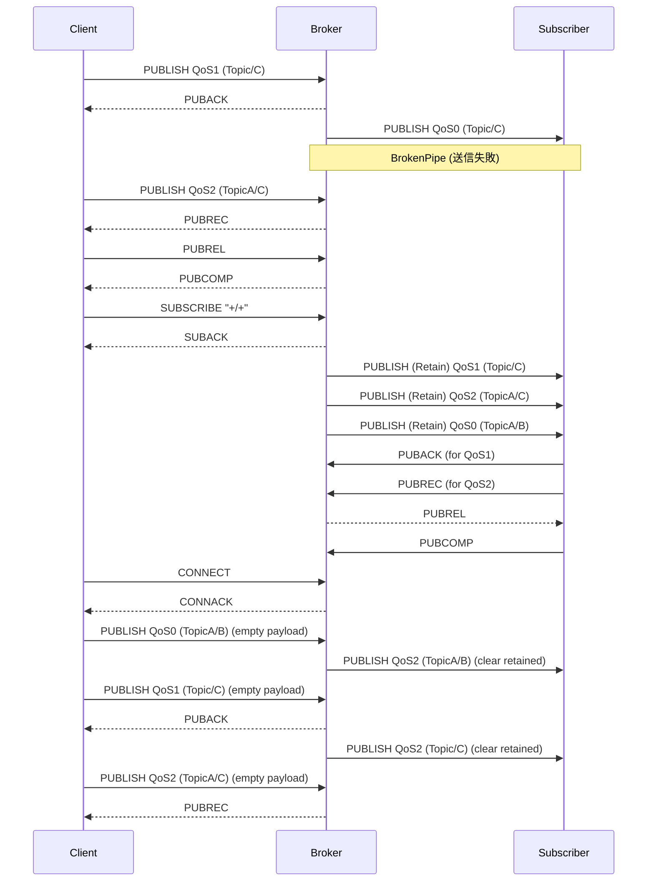

```mermaid
sequenceDiagram
    participant Client
    participant Broker
    participant Subscriber

    %% QoS1 Publish
    Client->>Broker: PUBLISH QoS1 (Topic/C)
    Broker-->>Client: PUBACK
    Broker->>Subscriber: PUBLISH QoS0 (Topic/C)
    Note over Broker,Subscriber: BrokenPipe (送信失敗)

    %% QoS2 Publish
    Client->>Broker: PUBLISH QoS2 (TopicA/C)
    Broker-->>Client: PUBREC
    Client->>Broker: PUBREL
    Broker-->>Client: PUBCOMP

    %% SUBSCRIBE
    Client->>Broker: SUBSCRIBE "+/+"
    Broker-->>Client: SUBACK
    Broker->>Subscriber: PUBLISH (Retain) QoS1 (Topic/C)
    Broker->>Subscriber: PUBLISH (Retain) QoS2 (TopicA/C)
    Broker->>Subscriber: PUBLISH (Retain) QoS0 (TopicA/B)

    Subscriber->>Broker: PUBACK (for QoS1)
    Subscriber->>Broker: PUBREC (for QoS2)
    Broker-->>Subscriber: PUBREL
    Subscriber->>Broker: PUBCOMP

    %% 新規接続
    Client->>Broker: CONNECT
    Broker-->>Client: CONNACK

    %% Retain Clear - QoS0
    Client->>Broker: PUBLISH QoS0 (TopicA/B) (empty payload)
    Broker->>Subscriber: PUBLISH QoS2 (TopicA/B) (clear retained)

    %% Retain Clear - QoS1
    Client->>Broker: PUBLISH QoS1 (Topic/C) (empty payload)
    Broker-->>Client: PUBACK
    Broker->>Subscriber: PUBLISH QoS2 (Topic/C) (clear retained)

    %% Retain Clear - QoS2
    Client->>Broker: PUBLISH QoS2 (TopicA/C) (empty payload)
    Broker-->>Client: PUBREC

```