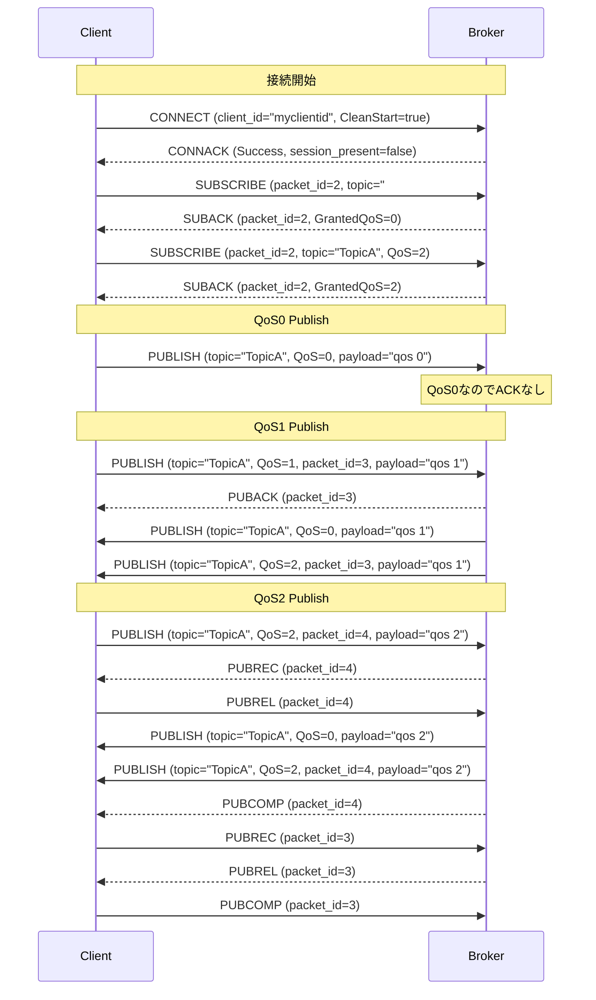

```mermaid
sequenceDiagram
    participant Client
    participant Broker

    Note over Client,Broker: 接続開始

    Client->>Broker: CONNECT (client_id="myclientid", CleanStart=true)
    Broker-->>Client: CONNACK (Success, session_present=false)

    Client->>Broker: SUBSCRIBE (packet_id=2, topic="#", QoS=0)
    Broker-->>Client: SUBACK (packet_id=2, GrantedQoS=0)

    Client->>Broker: SUBSCRIBE (packet_id=2, topic="TopicA", QoS=2)
    Broker-->>Client: SUBACK (packet_id=2, GrantedQoS=2)

    Note over Client,Broker: QoS0 Publish
    Client->>Broker: PUBLISH (topic="TopicA", QoS=0, payload="qos 0")
    Note over Broker: QoS0なのでACKなし

    Note over Client,Broker: QoS1 Publish
    Client->>Broker: PUBLISH (topic="TopicA", QoS=1, packet_id=3, payload="qos 1")
    Broker-->>Client: PUBACK (packet_id=3)
    Broker->>Client: PUBLISH (topic="TopicA", QoS=0, payload="qos 1")
    Broker->>Client: PUBLISH (topic="TopicA", QoS=2, packet_id=3, payload="qos 1")

    Note over Client,Broker: QoS2 Publish
    Client->>Broker: PUBLISH (topic="TopicA", QoS=2, packet_id=4, payload="qos 2")
    Broker-->>Client: PUBREC (packet_id=4)
    Client->>Broker: PUBREL (packet_id=4)
    Broker->>Client: PUBLISH (topic="TopicA", QoS=0, payload="qos 2")
    Broker->>Client: PUBLISH (topic="TopicA", QoS=2, packet_id=4, payload="qos 2")
    Broker-->>Client: PUBCOMP (packet_id=4)

    Client->>Broker: PUBREC (packet_id=3)
    Broker-->>Client: PUBREL (packet_id=3)
    Client->>Broker: PUBCOMP (packet_id=3)

```